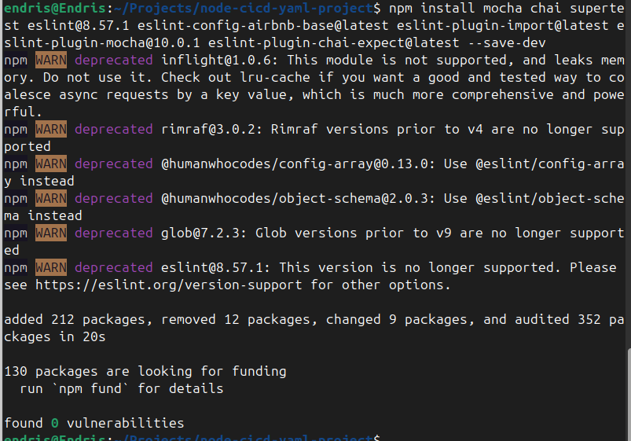
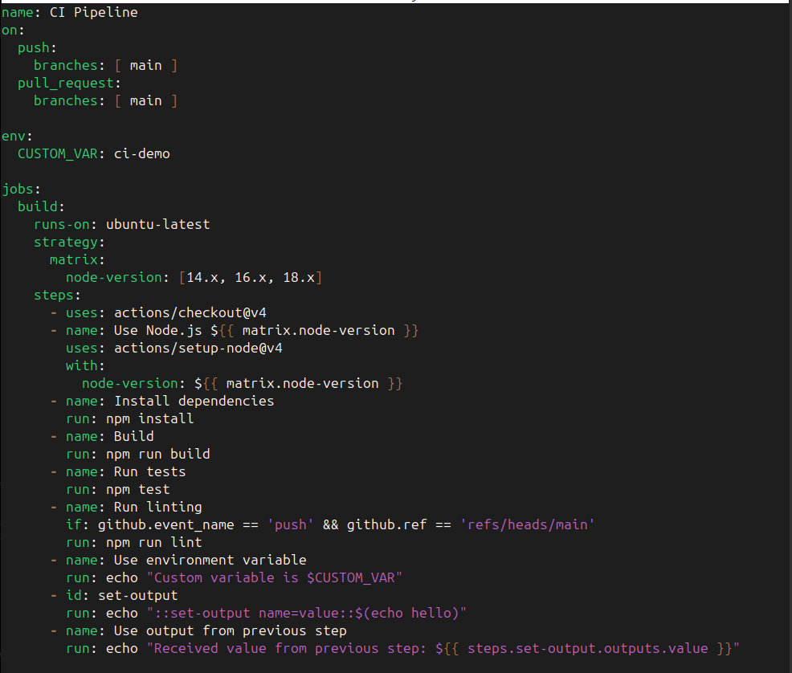
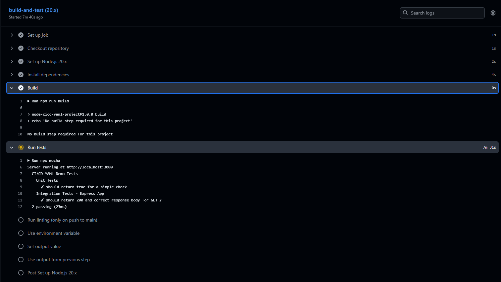

# node-cicd-yaml-project# GitHub Actions CI/CD Project – YAML

This project is part of the **GitHub Actions and CI/CD Course**, focusing on automating a Node.js application’s build, test, and linting processes using GitHub Actions. The goal is to create a simple Express.js application, set up a Continuous Integration (CI) pipeline with a build matrix, environment variables, and conditional execution, and document the process with code and screenshots.

## Project Overview

This project demonstrates how to use GitHub Actions to automate the testing and linting of a Node.js application. It includes:

- A simple Express.js server serving a static webpage.
- Unit and integration tests using Mocha, Chai, and Supertest.
- Linting with ESLint to enforce code quality.
- A GitHub Actions workflow with a build matrix (Node.js 14.x, 16.x, 18.x), environment variables, step outputs, and conditional execution.

The CI pipeline ensures the code is built, tested, and linted across multiple environments, providing confidence in code quality before potential deployment.

## Prerequisites

- **GitHub Account**: For creating and managing the repository.
- **Git Installed**: For version control and pushing code.
- **Node.js and npm Installed**: For running the application and tests.
- **Familiarity with JavaScript**: To understand the code and tests.
- **Text Editor or IDE**: Visual Studio Code used for editing.
- **Command Line Interface (CLI)**: For running commands (e.g., WSL or terminal).
- **Basic Understanding of YAML**: To configure GitHub Actions workflows.
- **Internet Connection**: For GitHub and npm operations.
- **Willingness to Learn and Experiment**: To explore CI/CD concepts.

## Step-by-Step Implementation

### 1. Setting Up the GitHub Repository

1. **Created a GitHub Repository**:

   - Created a new repository named `node-cicd-yaml-project` on GitHub.
   - Initialized with a `README.md` and a `.gitignore` file (Node.js template).
   - Cloned the repository locally:

     ```bash
     git clone https://github.com/your-username/node-cicd-yaml-project.git
     cd node-cicd-yaml-project
     ```


### 2. Creating the Node.js Application

1. **Initialized the Node.js Project**:

   - Initialized the project with:

     ```bash
     npm init -y
     ```
   - Installed Express.js for the web server:

     ```bash
     npm install express
     ```
   - Installed development dependencies for testing and linting:

     ```bash
     npm install mocha chai supertest eslint eslint-config-airbnb-base eslint-plugin-import eslint-plugin-mocha eslint-plugin-chai-expect --save-dev
     ```

   

2. **Created Application Code**:

   - Created `index.js` to set up a basic Express server (see `index.js` artifact).
   - Created `test.js` with unit and integration tests (see `test.js` artifact).
   - Configured ESLint with `.eslintrc.json` to enforce code quality (see `.eslintrc.json` artifact).
   - Updated `package.json` with scripts for start, test, lint, and build (see `package.json` artifact).

3. **Tested Locally**:

   - Ran the application:

     ```bash
     npm start
     ```
     - Verified the page at `http://localhost:3000`.
   - Ran tests:

     ```bash
     npm test
     ```
   - Ran linting:

     ```bash
     npm run lint
     ```

   

   

   

### 3. Setting Up GitHub Actions CI Workflow

1. **Created the CI Workflow File**:

   - Created `.github/workflows/ci.yml` to automate building, testing, and linting across Node.js versions 14.x, 16.x, and 18.x, with environment variables, step outputs, and conditional execution (see `ci.yml` artifact).

   

2. **Pushed Changes to GitHub**:

   - Committed and pushed the code:

     ```bash
     git add .
     git commit -m "Initial setup with Express app, tests, ESLint, and GitHub Actions CI workflow"
     git push origin main
     ```


3. **Verified Workflow Execution**:

   - Checked the GitHub Actions tab for the `CI Pipeline` run.
   - Confirmed all matrix jobs (Node.js 14.x, 16.x, 18.x) passed, including steps for `npm install`, `npm run build`, `npm test`, `npm run lint`, environment variable usage, and step outputs.

   

## Project Structure

```
node-cicd-yaml-project/
├── .github/
│   └── workflows/
│       └── ci.yml
├── img/
│   ├── npm-install.png
│   ├── project-files.png
│   ├── local-app-running.png
│   ├── test-results.png
│   ├── lint-results.png
│   ├── ci-yml.png
│   ├── git-push.png
│   ├── ci-workflow.png
├── .eslintrc.json
├── index.mjs
├── test.mjs
├── package.json
├── .gitignore
├── node_modules/
└── README.md
```

## Lessons Learned

- **Workflow Syntax**: Learned YAML syntax for GitHub Actions, including events (`on`), jobs, steps, and environment variables.
- **Build and Test Automation**: Configured build steps (`npm install`, `npm run build`) and test steps (`npm test`, `npm run lint`) in the CI pipeline.
- **Build Matrix**: Implemented parallel testing across Node.js versions 14.x, 16.x, and 18.x to ensure compatibility.
- **Environment Variables**: Used `CUSTOM_VAR` to pass configuration dynamically in the workflow.
- **Step Outputs**: Shared data between steps using `::set-output`.
- **Conditional Execution**: Configured linting to run only on push to the `main` branch.
- **Code Quality**: Enforced coding standards with ESLint, resolving potential conflicts between Airbnb and Mocha rules.


## Conclusion
This project successfully demonstrates how to set up a CI/CD pipeline using GitHub Actions for a Node.js application. It covers the entire process from creating a simple Express.js server, writing tests, configuring ESLint, to automating the build and test processes across multiple Node.js versions. The use of environment variables, step outputs, and conditional execution enhances the workflow's flexibility and efficiency.

